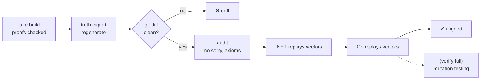

# Conformance pipeline

`task verify` runs exactly what CI runs:



## 1. Conformance vectors

`lake exe truth export` runs `step` on two kinds of trace and records every answer:

- **Scenarios**: named, hand-written business examples, such as *"total exactly
  at threshold is auto-approved"*.
- **Generated traces**: 300 pseudo-random traces from a fixed seed. Event and value
  choices are biased toward boundaries (`0`, `maxQty`, `maxQty + 1`,
  `approvalThreshold ± 1`, …).

The file format is deliberately boring JSON, one step per line so git diffs stay readable:

```json
{"event": {"type": "AddLine", "sku": "SKU-1", "qty": 2, "unitPrice": 1000},
 "expect": {"ok": true, "status": "Draft", "total": 2000, "lines": 1, "approved": false}}
{"event": {"type": "Ship"}, "expect": {"ok": false, "error": "InvalidTransition"}}
```

Each language needs only a **generic replay harness** of about 100 lines, which never
changes when business rules change. See
`impl/dotnet/tests/Orders.Conformance/ConformanceTests.cs` and
`impl/go/orders/conformance_test.go`.

!!! info "Why not call Lean at test time?"
    Committed vectors mean teams need **no Lean toolchain**, tests are fast
    and hermetic, and every spec change shows up as a reviewable diff. A live
    oracle (Lean as a sidecar process for property-based testing) is listed in
    [Ideas](../discussion/ideas.md).

## 2. Code generation (shape)

Names, enums and constants are generated and never retyped:

=== "C# (Contract.g.cs)"

    ```csharp
    --8<-- "impl/dotnet/src/Orders/Generated/Contract.g.cs"
    ```

=== "Go (contract_gen.go)"

    ```go
    --8<-- "impl/go/orders/contract_gen.go"
    ```

Both languages also have a `Generated_code_matches_manifest` test that compares
the code with `manifest.json`.

## 3. Drift gate

`task contracts:check` regenerates everything and runs `git diff --exit-code`
on the generated paths. It catches:

- a spec change committed without regenerating the contracts,
- a hand-edit to generated code,
- a stale generated state-machine page.

## 4. Trust-base audit

`task lean:audit` fails on any `sorry` (an unfinished proof) or custom `axiom`,
and prints `#print axioms` for every key theorem:

```text
'Truth.Order.reachable_inv' depends on axioms: [propext, Classical.choice, Quot.sound]
'Truth.Order.replayState_reachable' does not depend on any axioms
```

The three standard axioms are fine. `sorryAx` would mean the "truth" is only a claim.

## 5. Mutation testing

The vectors pass, but would they catch a real bug? `task mutate` copies each
implementation to a temp folder, injects a realistic bug, and expects the
conformance suite to fail.

```text
  [go    ] threshold boundary >= instead of >               KILLED
  [go    ] max quantity off by one                          KILLED
  [go    ] approval flag not recorded                       KILLED
  [go    ] cancelled order can be cancelled again           KILLED
  [go    ] line limit off by one                            KILLED
  [go    ] error precedence: price checked before qty       KILLED
  [dotnet] threshold boundary >= instead of >               KILLED
  [dotnet] approval flag not recorded                       KILLED
  [dotnet] reject cancels instead of returning to draft     KILLED
  [dotnet] can ship directly from pending approval          KILLED
  [dotnet] max price accepted one cent too high             KILLED

Mutation score: 100% (11/11 killed)
```

A **surviving** mutant is a finding about the *vector generator*, not the
implementation. Fix it in `lean/Truth/Export/Vectors.lean`. This gives the
architect a measurable quality signal for the truth's test oracle.

## CI

`.github/workflows/ci.yml` runs `task verify:full` on Ubuntu with the same
PowerShell scripts, so there is no divergence between local and CI.
`.github/workflows/docs.yml` publishes this site to GitHub Pages.
