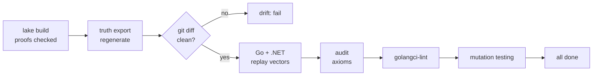

# Conformance pipeline

`task all` runs the same gate locally and in CI:



## 1. Conformance vectors

`lake exe truth export` runs the spec on message sequences and records every
answer.

- **Scenarios**: named, hand-written examples, for example *"vessel leaves
  before acknowledgement: alarm waits for the operator"*. They read like
  acceptance criteria.
- **Generated traces**: pseudo-random from a fixed seed, biased toward
  boundaries: zone edges, `staleAfter - 1`, duplicated and late timestamps,
  "not available" markers, unknown units, `freshFor + 1`.
- **Convergence cases** (health only): the same reports as two shuffled inboxes
  with duplicates, plus a split inbox that is merged. The exporter checks the
  theorems on each case before writing it.

One step per line keeps git diffs readable:

```json
{"event": {"type": "Report", "ts": 100, "lat": 35100000, "lon": 1200000},
 "expect": {"ok": true, "alarm": "UnackActive", "inside": true, "lost": false, "authorized": false, "lastTs": 100}}
{"event": {"type": "Report", "ts": 100, "lat": 35100000, "lon": 1200000},
 "expect": {"ok": false, "error": "StaleReport"}}
```

Each language has a generic replay harness. It knows the wire format, not the
business rules, and does not change when the rules change.

!!! info "Why commit vectors instead of calling Lean at test time?"
    Teams need no Lean toolchain. Tests are fast and hermetic. Every spec change
    shows up as a reviewable data diff. A live oracle for fuzzing is listed in
    [Ideas](../discussion/ideas.md).

## 2. Code generation (shape)

Names, enum values and constants are generated, with documentation taken from
the spec:

=== "C# (Zone)"

    ```csharp
    --8<-- "impl/dotnet/src/Surveillance/Zone/Generated/Contract.g.cs"
    ```

=== "Go (Zone)"

    ```go
    --8<-- "impl/go/zone/contract_gen.go"
    ```

=== "C# (Health)"

    ```csharp
    --8<-- "impl/dotnet/src/Surveillance/Health/Generated/Contract.g.cs"
    ```

=== "Go (Health)"

    ```go
    --8<-- "impl/go/health/contract_gen.go"
    ```

Go's `exhaustive` linter then enforces that every `switch` over a spec enum
handles every value. Add a state to the spec, regenerate, and the linter points
at every place in Go that must decide what to do with it.

## 3. Drift gate

`task drift` regenerates everything and runs `git diff --exit-code` on the
generated paths. It catches:

- a spec change committed without regenerating,
- a hand edit to generated code,
- a stale reference page.

`.gitattributes` pins generated files to LF, so the gate gives the same answer
on Windows and elsewhere.

## 4. Trust-base audit

`task audit` fails on `sorry` (an unfinished proof), custom `axiom` and
`native_decide` (which trusts the compiler, not only the kernel). It prints
`#print axioms` for every key theorem:

```text
'Truth.Zone.no_silent_clear' depends on axioms: [propext]
'Truth.Health.convergence' depends on axioms: [propext, Classical.choice, Quot.sound]
'Tutorial.Nmea.unarmor_armor' does not depend on any axioms
```

The three standard axioms are fine. `sorryAx` would mean the "truth" is only a
claim.

## 5. Mutation testing

The vectors pass. Would they catch a real bug? `task mutate` copies each
implementation to a temp folder, injects one realistic bug, and requires the
conformance tests to fail.

```text
  [go    ] silent clear: unacknowledged alarm returns to normal    KILLED
  [go    ] duplicate AIS report accepted                           KILLED
  [go    ] zone boundary excluded                                  KILLED
  [go    ] track lost one second late                              KILLED
  [go    ] going dark clears the alarm                             KILLED
  [go    ] permit ignored                                          KILLED
  [go    ] longitude not-available marker treated as invalid       KILLED
  [go    ] tie prefers the better report                           KILLED
  [go    ] freshness off by one                                    KILLED
  [go    ] last arrival wins (not a CRDT)                          KILLED
  [dotnet] silent clear: unacknowledged alarm returns to normal    KILLED
  [dotnet] duplicate AIS report accepted                           KILLED
  [dotnet] re-entry does not re-activate                           KILLED
  [dotnet] older report wins                                       KILLED
  [dotnet] freshness uses probe interval only                      KILLED
  [dotnet] observer tie-break reversed                             KILLED
mutation score: 16/16 killed
```

A mutant that does not compile is an error in the mutant list, not a kill. A
**surviving** mutant is a finding about the *vector generator*. Fix it in
`lean/Truth/Export`. That gives the architect a measurable quality signal for
the oracle.

## CI

`.github/workflows/ci.yml` runs `task all` on `windows-latest` with the same
PowerShell scripts. Test logs from `.test-results/` are kept as a build
artifact. `.github/workflows/docs.yml` publishes this site to GitHub Pages.
