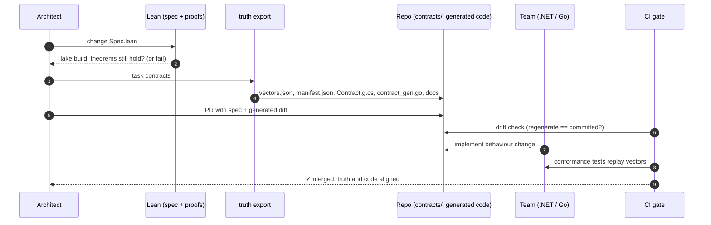

# Part 2 · Lean as architectural truth

## The problem

In a typical enterprise, the "truth" about a domain is scattered. It lives in
Confluence pages, BPMN diagrams, ADRs, OpenAPI files, and the heads of a few
senior people. Each team re-implements its understanding of that truth, and
the implementations drift. Nobody can say with confidence that *every* service
enforces the four-eyes rule on large orders.

Traditional mitigations each cover only part of the problem:

| Artifact | Precise? | Checked against code? | Can express *rules over all behaviours*? |
|---|---|---|---|
| Wiki / diagrams | ✗ | ✗ | ✗ |
| OpenAPI / JSON Schema | shape only | ✓ (contract tests) | ✗ |
| Shared test suite | examples only | ✓ | ✗ |
| **Executable Lean spec + proofs + vectors** | ✓ | ✓ (conformance) | ✓ (theorems) |

## The approach in this repo

The approach separates **three kinds of guarantee**:

1. **Internal consistency of the truth.** *The spec cannot violate the business rules.*
   This is checked by Lean's kernel and is a proof, for all inputs.
2. **Shape alignment.** *The code uses the same names, enums and constants.*
   This comes from code generation plus a drift check, so it is exact.
3. **Behavioural alignment.** *The code reacts to events like the spec.*
   This comes from conformance vectors. It is strong but *sampled*, and
   [mutation testing](conformance.md#5-mutation-testing) measures how strong.

Read on:

- [The Order specification](order-spec.md): what the truth looks like
- [Conformance pipeline](conformance.md): vectors, codegen, drift, audit, mutation
- [Implementations](implementations.md): what teams actually write
- [Operating model](operating-model.md): ownership, versioning, change process
