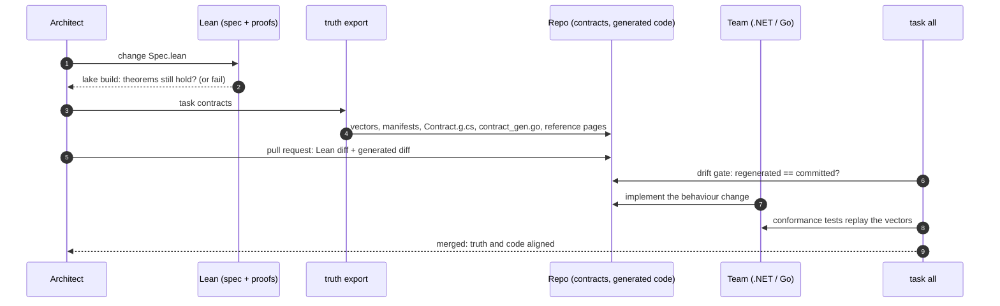

# Part 2 - Lean as architectural truth

## The problem

A maritime surveillance system is many services built by several teams. An AIS
ingest service in Go. An alarm service. An operator console in .NET (WPF or
web). A platform that runs primary and standby instances on every site.

Each team implements its understanding of the same rules:

- when is a vessel "inside" the safety zone, and is the boundary inside?
- does an alarm clear itself when the vessel leaves, or does it wait for the operator?
- what happens when AIS goes dark, or a report arrives twice, or late?
- which health report wins when primary and standby disagree?

The rules live in documents, tickets and heads. The implementations drift. In
an incident review nobody can say that *every* service handles a late report
the same way.

| Artifact | Precise? | Checked against code? | Rules over *all* message sequences? |
|---|---|---|---|
| Wiki, diagrams | no | no | no |
| OpenAPI, JSON Schema, CUE | shape and data constraints | yes | no |
| Shared test suite | examples only | yes | no |
| **Lean spec + theorems + generated vectors** | yes | yes (conformance) | yes (theorems) |

## The approach

Three kinds of guarantee, from strongest to weakest:

1. **The truth is internally consistent.** The spec cannot violate its rules.
   Checked by Lean's kernel: a proof, for all inputs and all message orders.
2. **Shape alignment.** The code uses the same names, enum values and
   constants. Generated from the spec and drift-checked: exact.
3. **Behavioural alignment.** The code reacts to messages like the spec.
   Conformance vectors: strong but *sampled*.
   [Mutation testing](conformance.md#5-mutation-testing) measures how strong.

## Two specs, two kinds of truth

| | [Safety zone](zone-spec.md) | [Site health view](health-spec.md) |
|---|---|---|
| Shape | one actor per vessel, state machine | replicated state, CRDT |
| Key question | does the alarm always tell the truth? | do all replicas show the same truth? |
| Main theorem | alarm active exactly when an unauthorized vessel is inside | same reports in any order give the same view |
| Messy reality | duplicates, late reports, AIS going dark | late, reordered, duplicated reports, anti-entropy |
| Uncomfortable finding | a late intrusion report is never seen | on equal time, the worse report wins, by design |

Read on:

- [Safety zone spec](zone-spec.md)
- [Site health spec](health-spec.md)
- [Conformance pipeline](conformance.md)
- [Implementations](implementations.md)
- [Operating model](operating-model.md)
