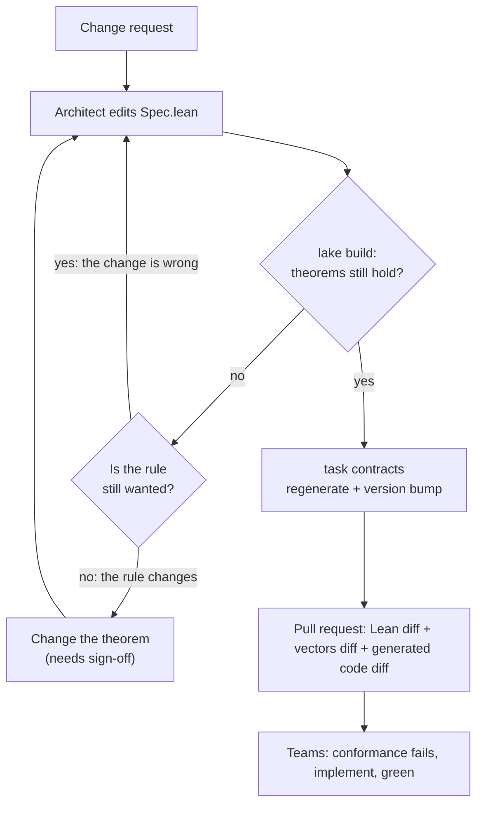
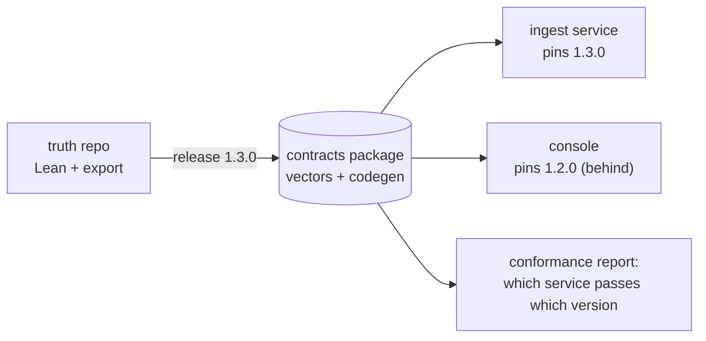

# Operating model

The technology works. The organisation around it decides whether it survives.
This page is a proposal to argue with.

## Ownership

| Asset | Owner | Reviewers |
|---|---|---|
| `lean/Truth/*/Spec.lean` (behaviour) | domain architect | product owner, tech leads |
| `lean/Truth/*/Properties.lean` (theorems) | architect or a "proof engineer" | safety, operations (they read statements, not proofs) |
| `lean/Truth/Export/*` (vectors, codegen) | platform team | architects |
| `contracts/*` (generated) | nobody edits by hand | drift gate |
| `impl/*` | product teams | their usual reviewers |

!!! tip "Theorem statements are the review surface"
    An operations lead will not review a 40-line proof, but can read and sign off
    `no_silent_clear` or `going_dark_keeps_alarm`. Lean guarantees the rest.
    Keep statements short and in business language.

## Change process

"The theorem no longer holds" is the whole value. It forces the conversation
about whether the rule or the change is wrong, before any code is written.

## Versioning

- `specVersion` in each `Spec.lean` is copied into every generated artifact.
- Suggested meaning:
    - **patch**: more vectors, better generator, no behaviour change
    - **minor**: additive (a new message or error code old clients never trigger)
    - **major**: an existing trace now has a different expected result
- In a multi-repo setup, publish `contracts/` as a versioned package (NuGet,
  Go module, OCI artifact). Teams pin a version and replay its vectors in CI.

## Mono-repo vs. multi-repo

This repo is a mono-repo: a spec change must keep every implementation green in
the same change. Strong, but it does not scale to many teams and release
trains.

The conformance report is perhaps the most useful architecture artifact of all:
evidence, not a slide.

## Coupling

In the [coupling scale](https://miroslav-matejovsky.github.io/architecture/coupling/)
this setup sits at levels 1 and 2: documented contract plus shared test suite.
No shared library, no shared framework, no runtime component. Teams keep full
autonomy of design and release. The usual price of that autonomy is alignment
effort and drift. A proven, executable contract with a generated TCK lowers
that price.

## Skills

Realistically a team needs **one or two people** who write Lean proofs.
Everyone else only needs to:

- read `Spec.lean` (it reads like a small functional program),
- read theorem statements,
- run `task all`.
