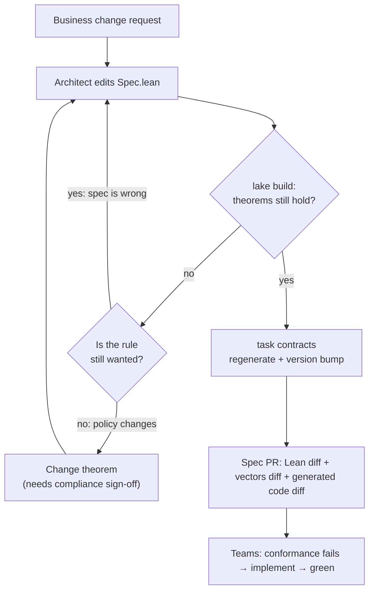
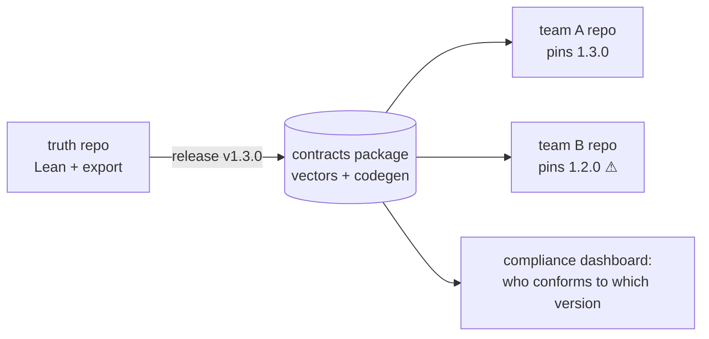

# Operating model

The technology works. The organisation around it decides whether it survives.
This page is a proposal to argue with, not a finished answer.

## Ownership

| Asset | Owner | Reviewers |
|---|---|---|
| `lean/Truth/**/Spec.lean` (behaviour) | Domain architect | Product owner, tech leads |
| `lean/Truth/**/Properties.lean` (theorems) | Architect / "proof engineer" | Compliance / risk (they read theorem *statements*, not proofs) |
| `lean/Truth/Export/**` (vector generator, codegen) | Platform / enablement team | Architects |
| `contracts/**` (generated) | Nobody edits by hand | CI drift gate |
| `impl/**` | Product teams | Their usual reviewers |

!!! tip "Theorem statements are the audit surface"
    A compliance officer can't review a 40-line proof, but can read and sign off
    a statement like `no_unapproved_large_shipment`. Lean guarantees the rest.
    Keep theorem statements short and in business language, and put the
    complexity in the proofs.

## Change process

The failure mode "theorem no longer holds" is **the whole value**. The tooling
forces a conversation about whether the rule or the change is wrong.

## Versioning

- `specVersion` in `Spec.lean` is copied into every generated artifact.
- Suggested SemVer semantics:
    - **patch**: more vectors, better generator, no behavioural change
    - **minor**: additive (new event or error code that old clients never trigger)
    - **major**: an existing trace now has a different expected result
- In a multi-repo world, publish `contracts/` as a versioned package (NuGet, Go
  module, OCI artifact). Teams pin a version, and their CI runs the vectors of that
  version. Renovate or Dependabot then opens "spec upgrade" PRs automatically.

## Mono-repo vs. multi-repo

This demo is a mono-repo, so every spec PR must keep all implementations green
**atomically**. That is strong, but it doesn't scale to 40 teams. The multi-repo variant:

The dashboard ("which services pass which spec version") is perhaps the most
valuable EA artifact of all, since it is *evidence* rather than a slide.

## Skills

Realistically, a team needs **one or two people** who can write Lean proofs.
Everyone else only needs to:

- read `Spec.lean` (it reads like a functional program),
- read theorem statements,
- run `task verify`.

Proof automation (`grind`, `omega`, `simp`) and LLM assistants are lowering
the bar quickly. See [Ideas](../discussion/ideas.md).
