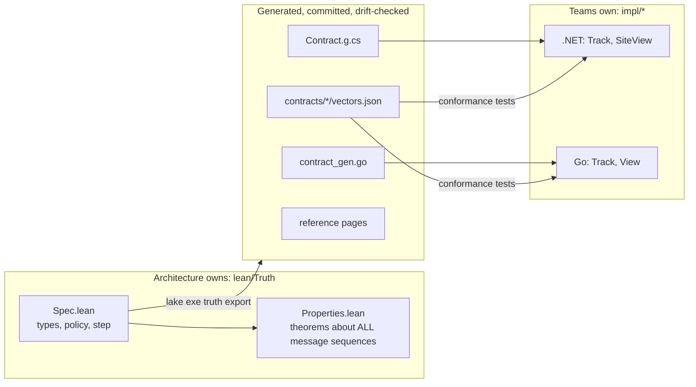

# Lean as Architectural Truth

A research and learning repository. One question:

> Can an architect write the *truth* about a system once, in a language where
> statements are **proven**, and then have an automated process confirm that
> independently built .NET and Go services stay aligned with it?

The answer here is **yes, for a useful slice of the problem**. The caveats are
real and are discussed openly in [Part 3](discussion/limits.md).

## Theories and proofs

Peter Naur described programming as *theory building*: the program is an
expression of a theory the team holds in their heads. My own working model is
the same. [I create theories and verify them against reality by building
proofs](https://miroslav-matejovsky.github.io/about/theories-and-proofs/):
architecture is a conceptual proof, code is an executable proof, and tests are
early warnings that a theory is degrading.

Lean closes a gap in that loop. The theory itself becomes a checked artifact:

| | Usually | With Lean |
|---|---|---|
| The theory | in heads, wikis, diagrams | `Spec.lean`: executable, precise |
| "The theory is consistent" | review meetings | `Properties.lean`: theorems checked by a kernel |
| "The code follows the theory" | hope, code review | conformance vectors generated from the theory |

## The domain

The examples come from maritime surveillance and high-reliability platforms:

- **Safety zone alarms.** AIS position reports arrive for vessels near an
  offshore installation. An unauthorized vessel inside the zone raises an alarm
  for an operator. Reports arrive late, duplicated or not at all.
- **Replicated site health.** A primary and a standby instance probe the same
  service units over a constrained network. Both consoles must show the same
  truth.
- **AIS on the wire.** NMEA checksums and 6-bit armoring, as a first taste of
  proofs about protocol code.

## The idea in one picture



In [coupling terms](https://miroslav-matejovsky.github.io/architecture/coupling/)
this is a *documented contract* plus a *shared test suite (TCK)*. It is the low
coupling end of the scale: no shared library, no shared framework, no runtime
dependency. Normally that end costs consistency. Here the contract is precise
and proven, and the TCK is generated from it, so it does not drift.

## Quick start

```powershell
task doctor      # tools present?
task all         # proofs, drift, conformance, audit, lint, mutation testing
task docs        # this site on http://localhost:8000
```

## How to read this site

| Part | Content |
|---|---|
| [1 - Learning Lean](tutorial/index.md) | propositions, induction, refinement, proofs about AIS/NMEA code |
| [2 - Lean as truth](architecture/index.md) | the two specs, the pipeline, the implementations, the operating model |
| [3 - Discussion](discussion/limits.md) | limits, alternatives (TLA+, Dafny, CUE, Cedar), ideas |
