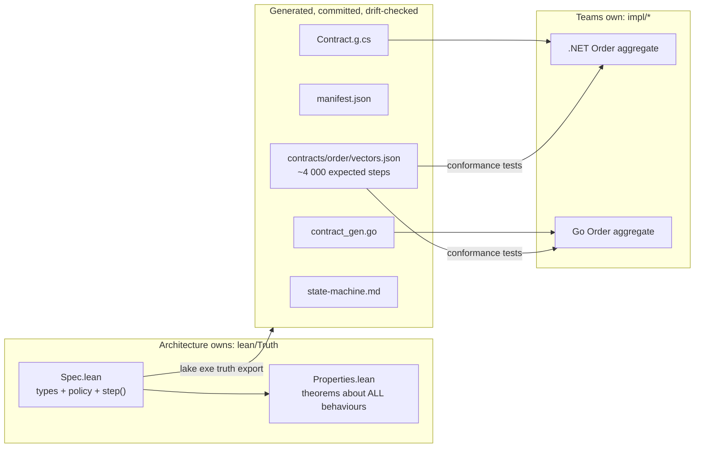

# Lean as Architectural Truth

This is a personal **research and learning** repository. It asks one question:

> Can an Enterprise Architect write the *truth* about a domain once, in a
> language where statements can be **proven**, and then have an automated
> process confirm that independently built .NET and Go services stay aligned with it?

The short answer from this repo is **yes, for a useful slice of the problem**.
There are real caveats, and they are discussed openly in [Part 3](discussion/limits.md).

## The idea in one picture



1. **Truth** – `lean/Truth/Order/Spec.lean` is an *executable* specification of an
   order lifecycle, with approval policy and limits.
2. **Proofs** – `Properties.lean` proves business rules for *every* reachable state.
   Examples: "no large order ships without human approval", and "totals never overflow Int64".
3. **Export** – the spec runs as an oracle. It generates test vectors, typed
   constants for C# and Go, and the [state machine diagram](reference/order-state-machine.md).
4. **Conformance** – the hand-written .NET and Go implementations replay every vector.
5. **Gates** – CI checks the proofs, runs a drift check (generated files must match the spec),
   runs conformance tests, and uses mutation testing to show that the vectors catch real bugs.

## Quick start

```powershell
task doctor      # are the tools installed?
task verify      # proofs → audit → drift → .NET → Go
task mutate      # inject bugs, watch the spec catch them
task docs        # this site on http://localhost:8000
```

## How to read this site

| Part | For whom | What you get |
|---|---|---|
| [1 · Learning Lean](tutorial/index.md) | anyone new to Lean | propositions, proofs, induction, refinement |
| [2 · Lean as truth](architecture/index.md) | architects, tech leads | the spec, the pipeline, the operating model |
| [3 · Discussion](discussion/limits.md) | skeptics (good!) | limits, alternatives (Dafny, TLA+, Cedar…), ideas |
