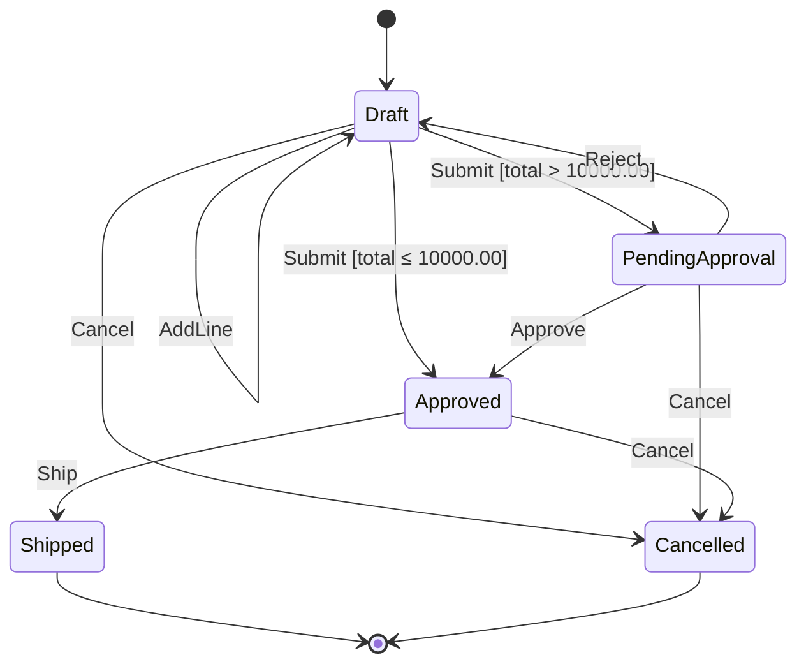

<!-- Generated by `lake exe truth export` from lean/Truth/Order/Spec.lean (spec 1.0.0). DO NOT EDIT. Change the Lean specification and run `task contracts`. -->

# Order state machine (spec 1.0.0)

!!! info "Generated from the specification"
    This page is produced by *executing* `step` from `lean/Truth/Order/Spec.lean` on
    representative orders. It cannot drift from the truth: CI regenerates it and fails on any diff.

## Diagram

## Transition table

Where two outcomes are shown, the first is for a small order (total ≤ 10000.00), the second for a large one.

| State | AddLine | Submit | Approve | Reject | Ship | Cancel |
|---|---|---|---|---|---|---|
| **Draft** | Draft | Approved / PendingApproval | ✗ InvalidTransition | ✗ InvalidTransition | ✗ InvalidTransition | Cancelled |
| **PendingApproval** | ✗ InvalidTransition | ✗ InvalidTransition | Approved | Draft | ✗ InvalidTransition | Cancelled |
| **Approved** | ✗ InvalidTransition | ✗ InvalidTransition | ✗ InvalidTransition | ✗ InvalidTransition | Shipped | Cancelled |
| **Shipped** | ✗ InvalidTransition | ✗ InvalidTransition | ✗ InvalidTransition | ✗ InvalidTransition | ✗ InvalidTransition | ✗ InvalidTransition |
| **Cancelled** | ✗ InvalidTransition | ✗ InvalidTransition | ✗ InvalidTransition | ✗ InvalidTransition | ✗ InvalidTransition | ✗ InvalidTransition |

## Policy constants

| Constant | Value |
|---|---|
| `approvalThreshold` | 1000000 (10000.00) |
| `maxLines` | 10 |
| `maxQty` | 10000 |
| `maxUnitPrice` | 100000000 (1000000.00) |

## Error codes

- `InvalidQuantity`
- `InvalidPrice`
- `TooManyLines`
- `EmptyOrder`
- `InvalidTransition`
