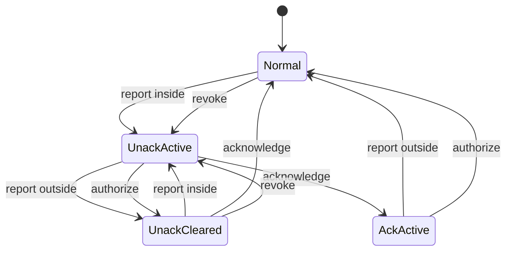

<!-- Generated by `lake exe truth export` from lean/Truth/Zone/Spec.lean (spec 1.0.0). DO NOT EDIT. Change the Lean specification and run `task contracts`. -->

# Safety zone alarm (spec 1.0.0)

!!! info "Generated from the specification"
    This page is produced by running `step` from `lean/Truth/Zone/Spec.lean` on sample tracks.
    CI regenerates it and fails on any difference, so it cannot drift from the spec.

## Alarm state machine

## Reaction table

Rows are alarm states. Columns are messages. A state can hold for two kinds of track.
Where two outcomes are shown, the first is for an unauthorized vessel outside the zone,
the second for an authorized vessel inside it.

| Alarm state | report inside | report outside | acknowledge | authorize | revoke | tick (dark) |
|---|---|---|---|---|---|---|
| **Normal** | UnackActive / Normal | Normal | x NothingToAcknowledge | Normal | Normal / UnackActive | Normal |
| **UnackActive** | UnackActive | UnackCleared | AckActive | UnackCleared | UnackActive | UnackActive |
| **AckActive** | AckActive | Normal | x NothingToAcknowledge | Normal | AckActive | AckActive |
| **UnackCleared** | UnackActive / UnackCleared | UnackCleared | Normal | UnackCleared | UnackCleared / UnackActive | UnackCleared |

## Policy constants

Positions are in AIS units of 1/10 000 minute (600 000 per degree).

| Constant | Value | Meaning |
|---|---|---|
| `unitsPerDegree` | 600000 | the number of AIS position units (1/10 000 minute) per degree. |
| `maxLat` | 54000000 | the largest valid latitude (90 degrees) in AIS units. |
| `maxLon` | 108000000 | the largest valid longitude (180 degrees) in AIS units. |
| `latNotAvailable` | 54600000 | the AIS marker for latitude not available (91 degrees). |
| `lonNotAvailable` | 108600000 | the AIS marker for longitude not available (181 degrees). |
| `zoneLatMin` | 35097300 | the southern boundary of the safety zone, inclusive. |
| `zoneLatMax` | 35102700 | the northern boundary of the safety zone, inclusive. |
| `zoneLonMin` | 1194800 | the western boundary of the safety zone, inclusive. |
| `zoneLonMax` | 1205200 | the eastern boundary of the safety zone, inclusive. |
| `staleAfter` | 180 | the number of seconds without a report after which a track is lost. |

## Error codes

- `PositionUnavailable`
- `InvalidPosition`
- `StaleReport`
- `NothingToAcknowledge`
